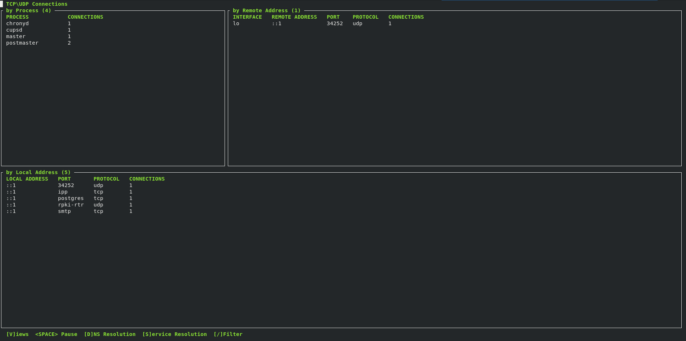

DASHNET 

A tui shell application displaying netstat-like data written in python.

- filter records with any regex
- reload current state to the shell screen every second
- pause the reload when desired
- split data into several views
- toggle between IPs and host names
- toggle between port numbers or service names

External dependencies:

- proc: https://proc.readthedocs.io
- psutil: https://github.com/giampaolo/psutil

Screenshots:

